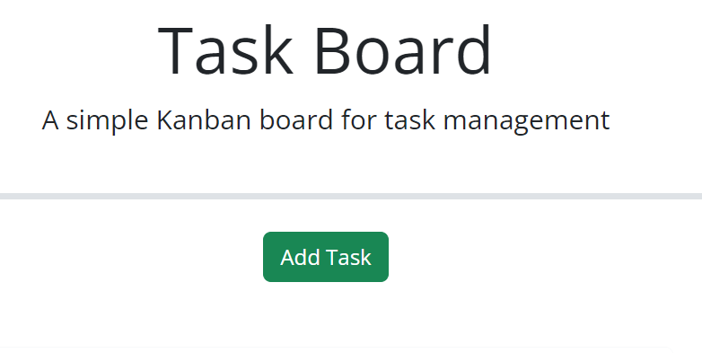
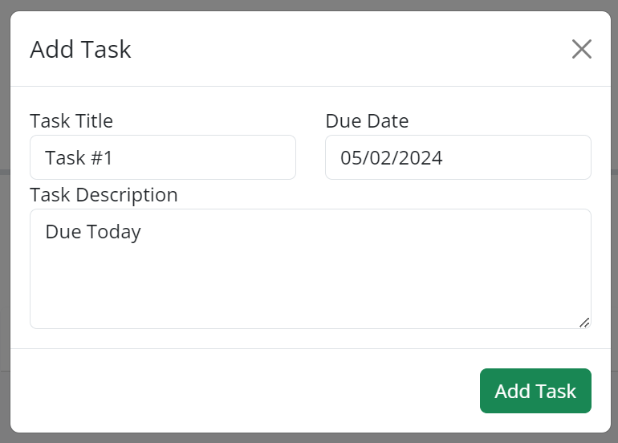
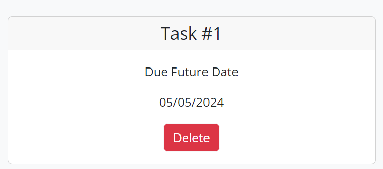
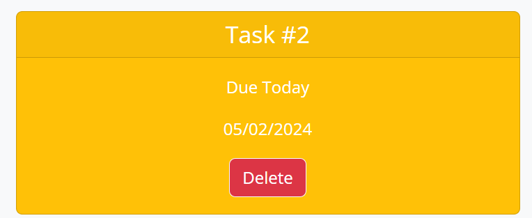
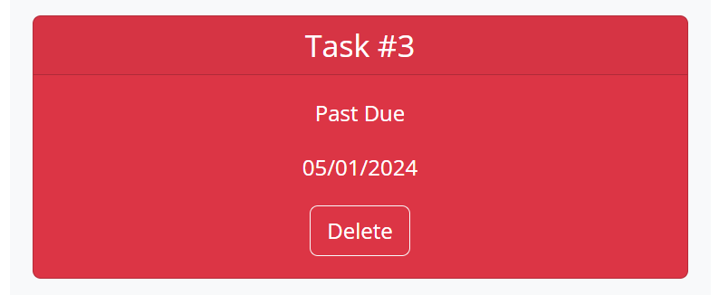
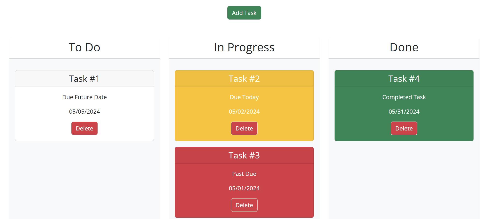

# Task Board

A simple Kanban board for task management.

## Table of Contents

- [Introduction](#introduction)
- [Features](#features)
- [Getting Started](#getting-started)
  - [Prerequisites](#prerequisites)
  - [Installation](#installation)
- [Usage](#usage)
- [License](#license)
- [Acknowledgements](#acknowledgements)

## Introduction

Task Board is a simple Kanban-style task management tool designed to help individuals or teams organize their tasks efficiently. With intuitive drag-and-drop functionality, users can easily move tasks between different stages, visualize their workflow, and stay on top of deadlines.

## Features

- **Simple Interface:** Clean and minimalistic user interface for seamless task management.
- **Task Creation:** Add new tasks with titles, descriptions, and due dates effortlessly.
- **Kanban Board:** Organize tasks into customizable swim lanes such as "To Do," "In Progress," and "Done."
- **Drag-and-Drop:** Intuitive drag-and-drop functionality to move tasks between different stages.
- **Task Status:** Visual indicators for task status based on due dates, making it easy to identify urgent tasks.
- **Persistence:** Tasks are persisted locally using browser storage, ensuring data is retained between sessions.

This page is written with the following technoplogies:
- **HTML**
- **CSS**
- **JavaScript**
- **Bootstrap**
- **J-Query UI and Day.js**

## Getting Started

### Prerequisites

- Modern web browser (Chrome, Firefox, Safari, Edge)
- Internet connection (for external resources)

### Installation

No installation is required. This app can be accessed at https://contra19.github.io/kanban-board/.

## Usage

1. Click on the "Add Task" button to create a new task.

  <figure>
    <figcaption>Add Task Button</figcaption>
    
  </figure>

2. Fill in the task title, due date, and description in the modal window. All fields are ***REQUIRED***
3. Click "Add Task" to add the task to the board.

  <figure>
    <figcaption>Completed form prior to submission</figcaption>
    
  </figure>

4. Created tasks are color coded: 
  
  <figure>
    <figcaption><strong>WHITE</strong> = Task due future date</figcaption>
    
  </figure>

  <figure>
    <figcaption><strong>YELLOW</strong> = Task due today</figcaption>
    
  </figure>

  <figure>
    <figcaption><strong>RED</strong> = Task past due</figcaption>
    
  </figure>

5. Drag and drop tasks between swim lanes to update their status. **ALL** tasks when moved to the "Done" lane will be colored **GREEN**.

  <figure>
    <figcaption>Tasks in different lanes. The "Done" task is now <strong>GREEN</strong>.</figcaption>
    
  </figure>

6. Tasks are automatically saved locally, ensuring persistence across sessions.

## License

This project is licensed under the [MIT License](LICENSE).

## Acknowledgements

I would like to acknowledge my classmates Tristan Rohr and Nick Zamboni. We worked together in several collaborative sessions where we
discussed code and process.  

Please find below links to the 3rd party APIs that were used. 
- [Bootstrap](https://getbootstrap.com/) - Frontend framework for responsive design.
- [jQuery UI](https://jqueryui.com/) - JavaScript library for draggable and droppable elements.
- [Day.js](https://day.js.org/) - Fast, lightweight, and modern date utility library.

